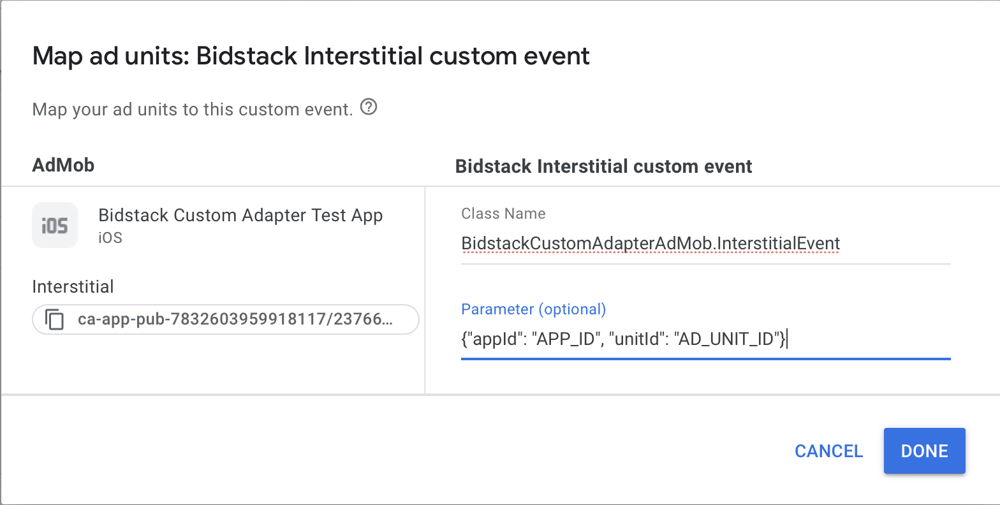
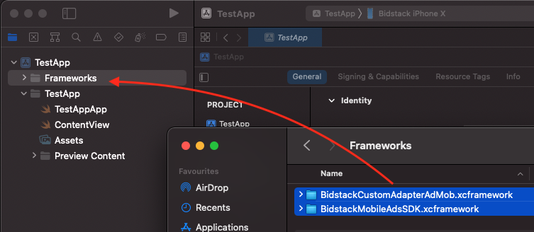
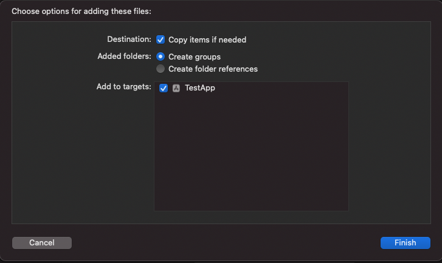
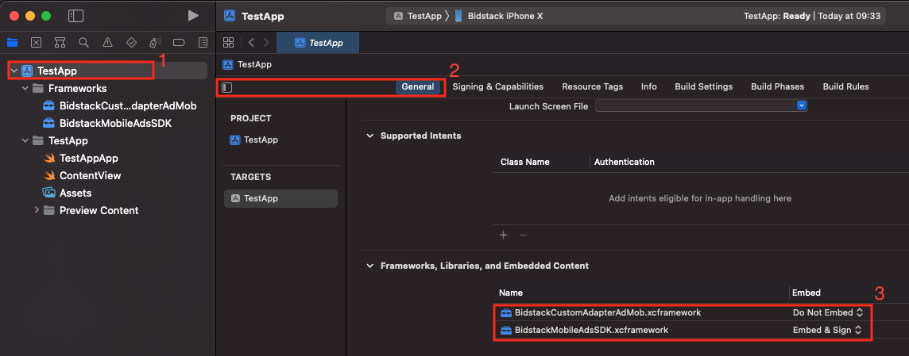

# Bidstack AdMob Adapter iOS installation guide

The Bidstack AdMob Adapter for iOS allows you to display Interstitial and Rewarded ads in your app through AdMob.

The adapter supports iOS 11 and up and GoogleMobileAdsSDK 9.2.0 and up.

## Table of contents

- [Prerequisites](#prerequisites)
- [Integration](#integration)
- [Supported versions](#supported-versions)

## Prerequisites

Required: iOS version 11+

Required: If you're planning to integrate adapter manually, then you need to download **BidstackCustomAdapterAdMob.xcframework** and **BidstackMobileAdsSDK.xcframework** provided by Bidstack.

### 1. Integrate GoogleMobileAdsSDK as documented [here](https://developers.google.com/admob/ios/quick-start) and integrate [interstitial](https://developers.google.com/admob/ios/interstitial) and [rewarded](https://developers.google.com/admob/ios/rewarded) ads.

### 2. Gather API key and ad unit ID's from [AdConsole](https://console.bidstack.com/auth/login).

### 3. Create mediation groups for each ad type in your AdMob dashboard:

1. Go to **Mediation** and select **Create meadiation group**. Select Ad format (Interstitial or Rewarded) and platform (iOS).
2. Enter Name of your Mediation Group (choose something for you to easy understand, like **Bidstack Mediation Interstitial** or **Bidstack Mediation Rewarded**).
3. Add Ad Units (ad units must be pre-created).
4. `Add Custom Event` at the end of the page. Enter Label and eCPM for custom event and press `Continue`.

5. Add Class Name and Parameter:
**IMPORTANT** - If you are creating mediation group for Interstitial ad, **Class Name** must be `BidstackInterstitialEvent` and for Rewarded ad - `BidstackRewardedEvent`.

**Parameter** must be in the format `{"appId": "APP_ID", "unitId": "AD_UNIT_ID"}` where:
 - `APP_ID` is the API key you retrieved from AdConsole
 - `AD_UNIT_ID` is the ad unit ID you retrieved from AdConsole

Now it should look similar to the picture belove:

6. When everything is set, press **DONE** and **SAVE**.

**Note**: You may need to wait several minutes until AdMob will recognize Bidstack Adapter.

## Integration 

There are two ways how you can integrate **BidstackCustomAdapterAdMob** into your project - using cocoapods or adding xcframeworks manually. 

### 1. Using cocoapods

Add to your podfile:
`pod 'BidstackCustomAdapterAdMob', '~> 1.5.0'`

That's it! Now you can run `pod install` from your Terminal and **BidstackCustomAdapterAdMob** and **BidstackMobileAdsSDK** will be installed automatically. No additional steps needed.

### 2. Add xcframeworks manually

#### 1. Create **Frameworks** folder

First of all, double check if your Xcode project contains a **Frameworks** folder in project navigator. If it doesn’t, you have to create one. The **Frameworks** folder is not added by default in latest Xcode and it’s a good practice to keep your frameworks there.

#### 2. Add **BidstackCustomAdapterAdMob.xcframework** and **BidstackMobileAdsSDK.xcframework** to Frameworks folder

Drag and drop both frameworks from Finder into the **Frameworks** folder. Make sure that the destination of drag is just under the **Frameworks** folder:

Then, make sure the following options are selected for adding files. Both “Copy items if needed” and “Create groups” should be checked and selected. Click Finish.

#### 3. Embed **BidstackCustomAdapterAdMob.xcframework** **BidstackMobileAdsSDK.xcframework** in project's target

In order to make sure that the framework will get copied to your app’s binary, follow these steps:

1. Navigate to your project settings by clicking on it in the project navigator. 
2. Make sure that your target is selected and General tab is open.
3. Select `Embed & Sign` for your newly added **BidstackMobileAdsSDK.xcframework**.
4. Make sure that for **BidstackCustomAdapterAdMob.xcframework** is selected `Do Not Embed`.

#### 4. Link **BidstackCustomAdapterAdMob.xcframework** and **BidstackMobileAdsSDK.xcframework** with your project

Navigate to the Build Phases tab, disclose the “Link Binary With Libraries” list and both frameworks are included in the list. It should already be included by default after following the steps above, however in case it’s not – click on the + button and add it.

Then make sure both framework Status is `Required`.

The **BidstackCustomAdapterAdMob.xcframework** and **BidstackMobileAdsSDK.xcframework** is now fully added and integrated with your Xcode project. No additional setup is needed.

## Supported versions

Supported **GoogleMobileAdsSDK** versions: 9.2.0 and up

Supported **iOS** versions: version 11+
