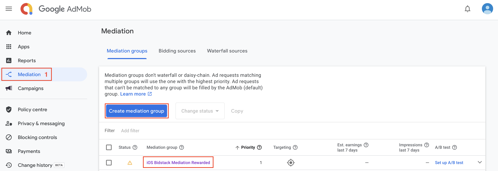
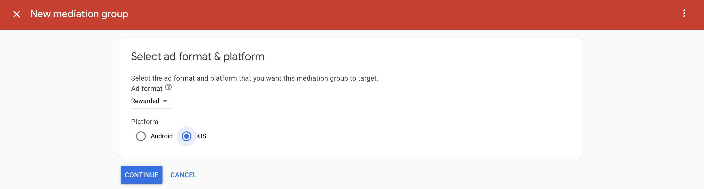
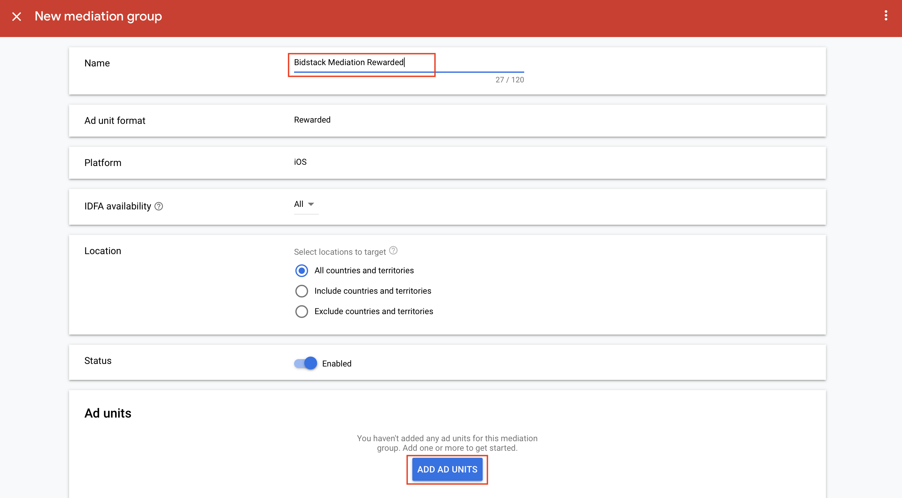
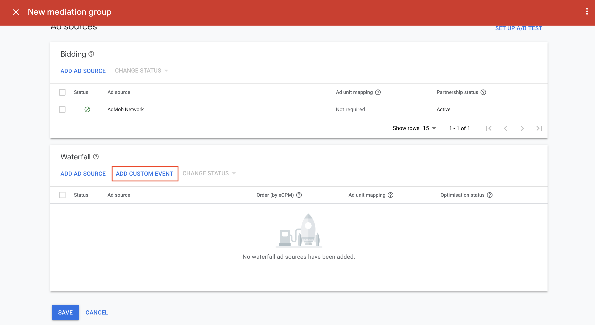
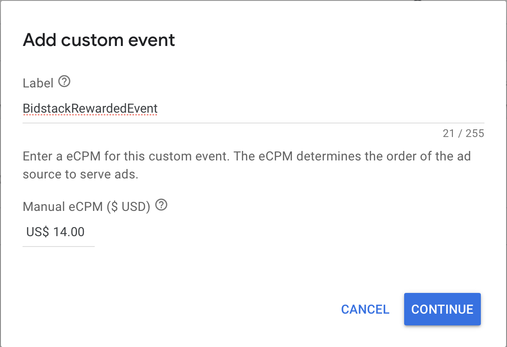
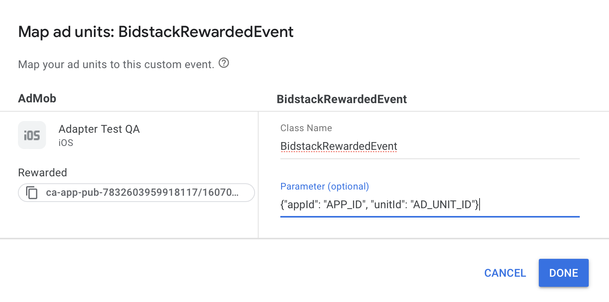
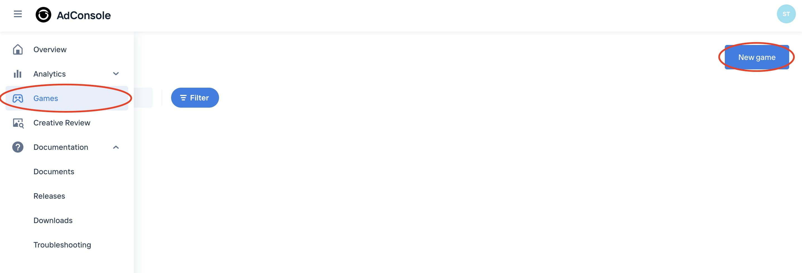
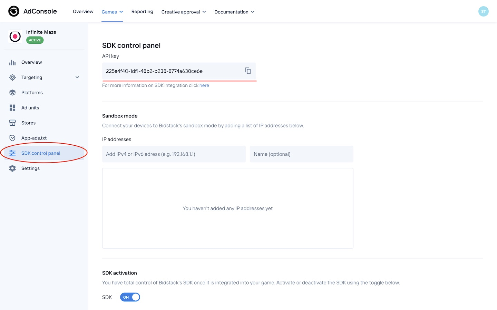
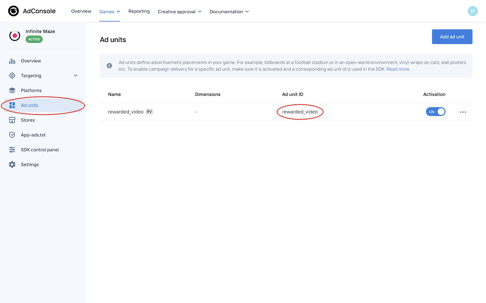

# Bidstack AdMob Adapter iOS installation guide

The Bidstack AdMob Adapter for iOS allows you to display Interstitial and Rewarded Video ads in your app through AdMob.

## Table of contents

- [Prerequisites](#prerequisites)
- [Integration](#integration)
- [Supported versions](#supported-versions)

## Prerequisites

Required: iOS version 11+

Required: If you're planning to integrate adapter manually, then you need to download **BidstackCustomAdapterAdMob.xcframework** and **BidstackMobileAdsSDK.xcframework** from [here](https://console.bidstack.com/developer/downloads). (Look for **AdMob Adapter -> iOS**).

Before integrating the adapter you will need to set up the Bidstack network on your AdMob account as documentad [here](https://support.google.com/admob/answer/3124703?hl=en&ref_topic=7383089#) and add a custom event as documented [here](https://support.google.com/admob/answer/3083407?visit_id=637861286402486571-3970687058&rd=1#) or follow the instructions in the header [Configure the ad network account settings](#configure-the-ad-network-account-settings) and integrate the AdMob as documented [here](https://developers.google.com/admob/ios/mediate)

#### Configure the ad network account settings

1. Login into your AdMob dashboard and go to **Mediation**. Then create a new mediation group or select created.

2. (If you already have a mediation group skip to point 5). For creating a mediation group choose the appropriate ad format and platform and click `Continue`

3. Enter any name for your mediation group and press `Add Ad Units`.

4. Choose ad units from your app and press `Done`.

5. Ad the bottom of the page press `Add Custom Event`

6. Enter any label for the custom event and also add eCPM. Then click `Continue`.

7. When prompted for `Class Name` enter:
    * `BidstackInterstitialEvent` for interstitial
    * `BidstackRewardedEvent` for rewarded
    
8. In the `Parameter` field you will need to enter the API key and ad unit ID from the AdConsole in the JSON format `{"appId": "API_KEY", "unitId": "AD_UNIT_ID"}` where:
 - `API_KEY` is the API key you retrieved from AdConsole
 - `AD_UNIT_ID` is the ad unit ID you retrieved from AdConsole

#####Retrieving `API_KEY` and `AD_UNIT_ID` from AdConsole:

8. Login into your AdConsole account and add a new game or select existing

9. From the navigation menu select `SDK control panel` and copy the API key. Paste this API key in the AdMob dashboard

10. From the navigation menu select `Ad units`. And then create and copy ad unit id. Also, paste the ad unit id in the AdMob dashboard

11. When everything is set, press **DONE** and **SAVE** in the AdMob dashboard.

**Note**: You may need to wait several minutes until AdMob will recognize Bidstack Adapter.

## Integration 

There are two ways how you can integrate **BidstackCustomAdapterAdMob** into your project - using cocoapods or adding xcframeworks manually. 

### 1. Using cocoapods

Add to your podfile:
`pod 'BidstackCustomAdapterAdMob', '~> 1.5.0'`

That's it! Now you can run `pod install` from your Terminal and **BidstackCustomAdapterAdMob** and **BidstackMobileAdsSDK** will be installed automatically. No additional steps needed.

### 2. Add xcframeworks manually

#### 1. Create **Frameworks** folder

First of all, double check if your Xcode project contains a **Frameworks** folder in project navigator. If it doesn’t, you have to create one. The **Frameworks** folder is not added by default in latest Xcode and it’s a good practice to keep your frameworks there.

#### 2. Add **BidstackCustomAdapterAdMob.xcframework** and **BidstackMobileAdsSDK.xcframework** to Frameworks folder

Drag and drop both frameworks from Finder into the **Frameworks** folder. Make sure that the destination of drag is just under the **Frameworks** folder:

Then, make sure the following options are selected for adding files. Both “Copy items if needed” and “Create groups” should be checked and selected. Click Finish.

#### 3. Embed **BidstackCustomAdapterAdMob.xcframework** **BidstackMobileAdsSDK.xcframework** in project's target

In order to make sure that the framework will get copied to your app’s binary, follow these steps:

1. Navigate to your project settings by clicking on it in the project navigator. 
2. Make sure that your target is selected and General tab is open.
3. Select `Embed & Sign` for your newly added **BidstackMobileAdsSDK.xcframework**.
4. Make sure that for **BidstackCustomAdapterAdMob.xcframework** is selected `Do Not Embed`.

#### 4. Link **BidstackCustomAdapterAdMob.xcframework** and **BidstackMobileAdsSDK.xcframework** with your project

Navigate to the Build Phases tab, disclose the “Link Binary With Libraries” list and both frameworks are included in the list. It should already be included by default after following the steps above, however in case it’s not – click on the + button and add it.

Then make sure both framework Status is `Required`.

The **BidstackCustomAdapterAdMob.xcframework** and **BidstackMobileAdsSDK.xcframework** is now fully added and integrated with your Xcode project. No additional setup is needed.

## Supported versions

Supported **GoogleMobileAdsSDK** versions: 9.2.0 and up

Supported **iOS** versions: version 11+
