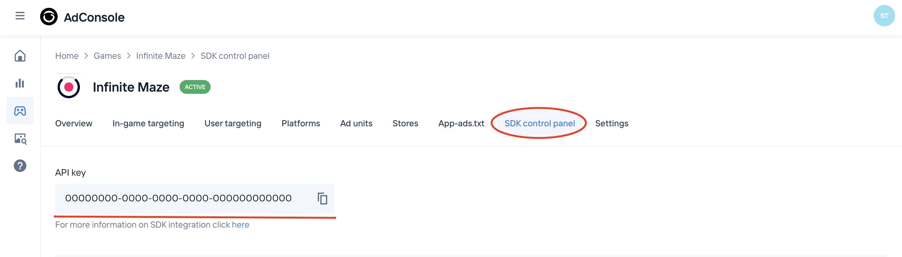
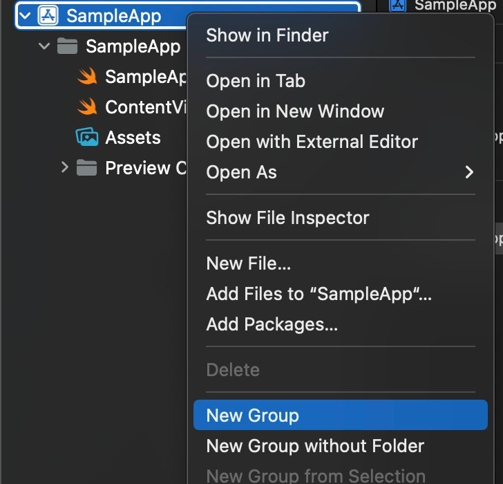
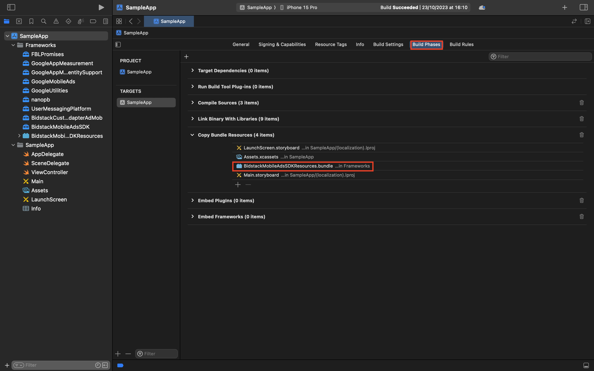

# Bidstack AdMob Adapter Installation Guide for iOS

The Bidstack AdMob Adapter for iOS allows you to display Interstitial and Rewarded ads in your app through AdMob.

## Table of contents

* [Prerequisites](#prerequisites)
* [Integration](#integration)
   * [Using CocoaPods](#using-cocoapods)
   * [Adding xcframeworks manually](#adding-xcframeworks-manually)
* [Privacy](#privacy)
* [Supported versions](#supported-versions)

## Prerequisites

**Required:** iOS version 12+

**Required:** If you're planning to integrate adapter manually, then you need to [download](https://console.bidstack.com/developer/downloads) **BidstackCustomAdapterAdMob.xcframework**, **BidstackMobileAdsSDK.xcframework** and **BidstackMobileAdsSDKResources.bundle** provided by Bidstack.

Before integrating the adapter, you will need to set up the Bidstack network in your AdMob account as documented [here](https://support.google.com/admob/answer/3124703?hl=en&ref_topic=7383089#) and add a custom event as documented [here](https://support.google.com/admob/answer/3083407?visit_id=637861286402486571-3970687058&rd=1#) or follow the instructions in the section [Configuring adapter in the AdMob dashboard](#configuring-adapter-in-the-admob-dashboard) and integrate the AdMob as documented [here](https://developers.google.com/admob/ios/mediate).
<div class="page-break"></div> 

### Configuring adapter in the AdMob dashboard

1. Login into your AdMob dashboard and go to **Mediation**. Then create a new mediation group or select created.

    

2. (If you already have a mediation group, skip to point 4). For creating a mediation group, choose the appropriate ad format and platform and click **Continue**

    
    <div class="page-break"></div>

3. Enter any name for your mediation group, and choose ad units from your app

    

4. At the bottom of the page, press **Add Custom Event**

    
    <div class="page-break"></div>

5. Enter any label for the custom event, and also add eCPM. Then click **Continue**

    

6. When prompted for **Class Name**, enter:
    * **BidstackInterstitialEvent** for interstitial
    * **BidstackRewardedEvent** for rewarded
7. In the **Parameter** field, you will need to enter the API key and ad unit name from the AdConsole in JSON format. For example: `{"apiKey": "API_KEY", "unitId": "AD_UNIT_ID"}`

    

8. Login into your AdConsole account and add a new game or select existing

    
    <div class="page-break"></div>

9. From the navigation menu, select **SDK control panel** and copy the API key. Paste this API key in the AdMob dashboard **parameter** field into JSON

    

10. From the navigation menu, select **Ad units**. And then create and copy the ad unit name. Also, paste the ad unit name in the AdMob dashboard **parameter** field into JSON

    

11. When everything is set, press **DONE** and **SAVE** in the AdMob dashboard.

## Integration 

There are two ways how you can integrate **BidstackCustomAdapterAdMob** into your project - using CocoaPods or adding xcframeworks manually. 

### Using CocoaPods

Add to your podfile:
`pod 'BidstackCustomAdapterAdMob', '~> 2.2.0'`

That's it! Now you can run `pod install` from your Terminal and **BidstackCustomAdapterAdMob** and **BidstackMobileAdsSDK** will be installed automatically. No additional steps needed.
<div class="page-break"></div> 

### Adding xcframeworks manually

#### 1. Create **Frameworks** folder

Firstly, double-check if your Xcode project contains a **Frameworks** folder in the project navigator. If it doesn’t, just like in the screenshot below, then you’ll have to create one. The Frameworks folder is not added by default in latest Xcode, and it’s a good practice to keep your frameworks there.


Right-click on your project in the project navigator (top-most entry) and select **New Group**. Name the new group **Frameworks**.




#### 2. Add BidstackCustomAdapterAdMob.xcframework, BidstackMobileAdsSDK.xcframework, and BidstackMobileAdsSDKResources.bundle to the Frameworks folder

With the **Frameworks** folder selected, click on **File -> Add Files** to “Your Project”


<div class="page-break"></div>

Find the **BidstackAdMobAdapter.xcframework**, **BidstackMobileAdsSDK.xcframework**, and **BidstackMobileAdsSDKResources.bundle** in the file navigator, select it, make sure “Copy items if needed” and “Create groups” are selected and click **Add**:


<div class="page-break"></div>

#### 3. Verify that frameworks were added correctly by following these steps:

1. Navigate to your project settings by clicking on it in the project navigator.
2. Select your target and open the **General** tab.
3. Make sure that **BidstackCustomAdapterIronSource.xcframework** and **BidstackMobileAdsSDK.xcframework** have **Do Not Embed** selected.

    
    <div class="page-break"></div>

4. Navigate to the **Build Phases** tab and open the **Copy Bundle Resources** section
5. Assure that **BidstackMobileAdsSDKResources.bundle** is added

    

The **BidstackCustomAdapterAdMob.xcframework** and **BidstackMobileAdsSDK.xcframework** are now fully added and integrated with your Xcode project. No additional setup is needed.
<div class="page-break"></div>

## Privacy

Bidstack provides APIs for passing privacy flags. Note that nothing in this document should be considered as legal advice.
If the user provided consent, set the following flag to `true`:

* Objective-C:
    ```objectivec
    [BidstackMobileAds setHasConsent: YES];
    ```
* Swift
    ```swift
    BidstackMobileAds.setHasConsent(true)
    ```

If the user is a child, set the following flag to `true`:

* Objective-C:
    ```objectivec
    [BidstackMobileAds setIsChildDirected: YES];
    ```
* Swift
    ```swift
    BidstackMobileAds.setIsChildDirected(true)
    ```

## Supported versions

* iOS 12 and up
* GoogleMobileAdsSDK 10.0.0 and up
